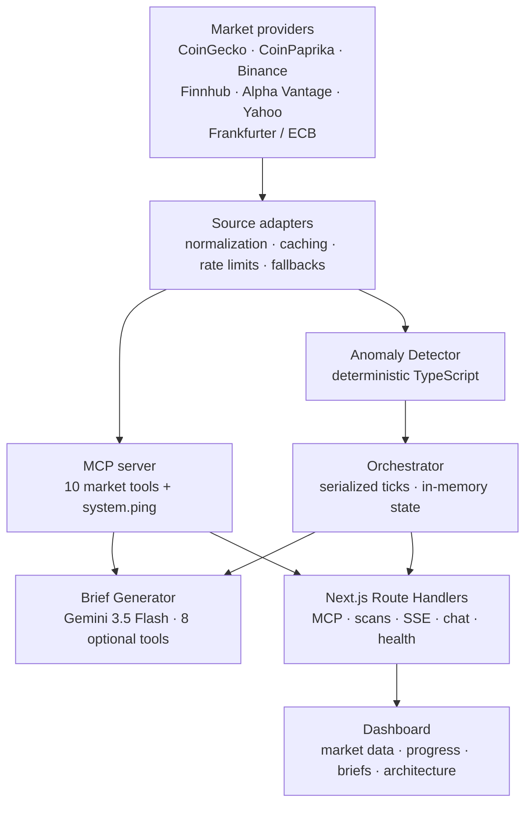

# Architecture

Market Inspector separates source access, MCP contracts, deterministic coordination, Gemini analysis, API routes, and presentation.

## High-level structure



## Component responsibilities

### Source layer

The source adapters in `lib/sources/` convert provider-specific responses into stable internal shapes.

- CoinGecko is the primary cryptocurrency source.
- CoinPaprika provides global and top-mover fallback data.
- Binance provides individual cryptocurrency price fallback data.
- Finnhub, Alpha Vantage, and Yahoo Finance form the equity fallback chain.
- Frankfurter exposes ECB foreign-exchange reference rates.

Each adapter applies a local rate limiter. CoinGecko responses use a 60-second in-process cache, and HTTP 429 responses open a 90-second circuit breaker.

### MCP layer

`lib/mcp/server.ts` registers 11 tools through the Vercel MCP adapter:

- 1 zero-cost system status tool
- 4 cryptocurrency tools
- 3 equity tools
- 3 foreign-exchange tools

The dynamic route at `app/api/[transport]/route.ts` delegates `/api/mcp`, `/api/sse`, and `/api/message` requests to the adapter.

### Coordinated roles

The system uses three roles with distinct responsibilities:

1. **Anomaly Detector** — fetches up to 30 cryptocurrency assets, filters movements above the configured threshold, sorts by absolute change, and returns up to five anomalies.
2. **Orchestrator** — serializes concurrent scan requests, stores the latest state, and notifies SSE listeners.
3. **Brief Generator** — preloads broad market context and uses Gemini for the final analysis. Gemini can request eight selected MCP tools for missing context.

The Anomaly Detector and Orchestrator are deterministic TypeScript components. Gemini is invoked only by the Brief Generator and the separate chat endpoint.

## Data flows

### Continuous anomaly stream

1. The dashboard opens `EventSource('/api/stream')`.
2. The route sends the current orchestrator state.
3. The route subscribes to state changes and requests a detector tick only for the first subscriber or when the current state is stale.
4. Detection repeats every 60 seconds without calling Gemini.
5. A heartbeat is sent every 25 seconds.
6. The client reconnects automatically when the serverless function rotates.

### Manual AI scan

1. The dashboard sends `POST /api/anomalies`.
2. The orchestrator serializes the request with any active scan.
3. The detector refreshes the anomaly list.
4. If a medium-or-higher anomaly exists, seven market results are loaded in parallel:
   - global cryptocurrency market
   - top 10 cryptocurrency assets
   - AAPL
   - MSFT
   - NVDA
   - GOOGL
   - USD reference rates against EUR, GBP, JPY, and CHF
5. Only successful tool results enter the snapshot.
6. Gemini receives the snapshot, anomalies, and any additional configured context.
7. Gemini may request up to four rounds of additional function calls.
8. The route streams progress events followed by either a completed state or an error event.
9. Generated content is informational, uses neutral monitoring priorities, and includes a financial-information disclaimer.

### Generic chat

`POST /api/chat` initializes the MCP HTTP client, lists all 11 tools, converts their schemas to Gemini-compatible function declarations, and executes requested tools through the MCP transport. Prompts are limited to 4,000 characters. The route is disabled in production unless `ENABLE_PUBLIC_CHAT=true` is set.

## Fallback behavior

```text
crypto.fetch_price:
  CoinGecko --rate limit--> Binance

crypto.fetch_top_movers / crypto.fetch_global:
  CoinGecko --rate limit--> CoinPaprika

stocks.fetch_quote / stocks.fetch_candles:
  Finnhub --> Alpha Vantage --> Yahoo Finance

forex.*:
  Frankfurter / ECB
```

Historical cryptocurrency data is currently CoinGecko-only. Equity symbol search is currently Finnhub-only.

## State and quota

The demo does not use a database.

- Orchestrator state is held in memory.
- React state preserves the most recent brief across SSE reconnections.
- `localStorage` stores the four-scan daily demonstration quota.
- `/api/anomalies` applies a matching four-scan in-memory per-client limit over a 24-hour window.

This design keeps the capstone lightweight and limits Gemini usage. It is intended for demonstration use rather than multi-user persistence.

The quota assumes the worst-case ceiling of five Gemini requests per notable-anomaly scan: one initial request plus up to four function-calling rounds. Browser storage failure does not block the current session; it only weakens persistence of the demonstration counter. Server-side limits are per instance and do not replace a shared quota store.

## Prompt and data guardrails

- Provider payloads, tool results, and user text are delimited as untrusted data.
- System instructions explicitly reject embedded role changes, secret requests, and output-format overrides.
- Gemini is instructed to use external text only as factual evidence.
- Briefs avoid personalized trading commands, guarantees, and unsupported certainty.
- CI, background scans, health checks, and `system.ping` never call Gemini.

## Observability

`lib/observability/logger.ts` emits redacted JSON events to standard output. Scan identifiers connect orchestrator, snapshot, tool, and Gemini events. Logged fields include durations, anomaly counts, model rounds, tool-call counts, known providers, fallback state, and sanitized errors. Full prompts, provider payloads, and credentials are not logged.

## Streaming

The scan and state routes use the Web Streams API from Next.js Route Handlers. Responses set:

- `Content-Type: text/event-stream`
- `Cache-Control: no-cache, no-transform`
- `X-Accel-Buffering: no`

Once streaming begins, failures are represented as SSE error events because the HTTP status has already been committed.

## Deployment

`vercel.json` configures:

- Next.js framework detection
- Frankfurt region (`fra1`)
- no-store API headers
- SSE-compatible response headers

Runtime versions are pinned in `package.json`:

- Node.js 22.x
- pnpm 10.34.4

Deployment secrets belong in platform environment variables and must not be committed.

## Delivery checks

GitHub Actions uses Node.js 22 and runs lint, type checking, deterministic tests, production build, and a Playwright smoke test. The browser test intercepts all market and scan APIs, so CI requires no provider key and spends no Gemini quota.
